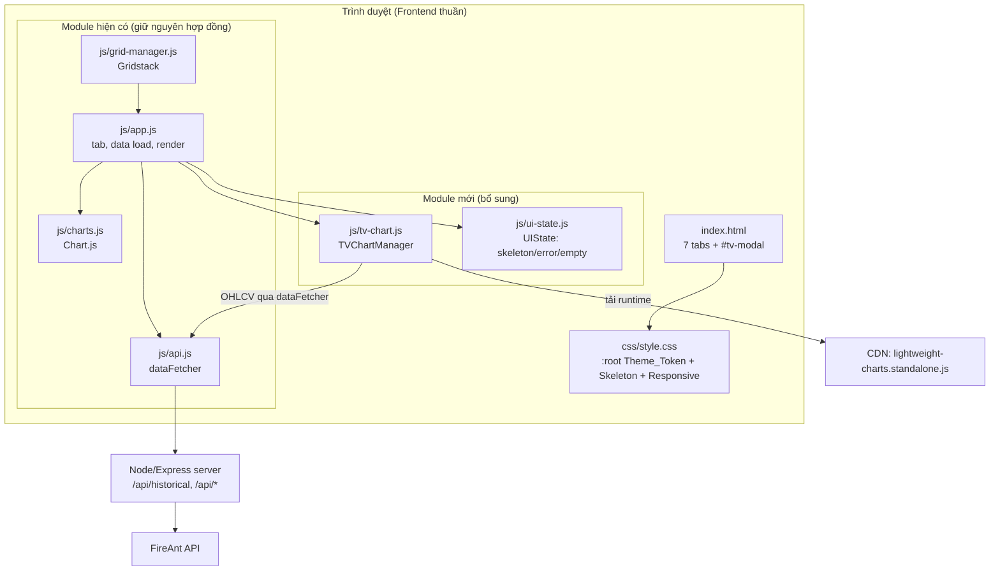
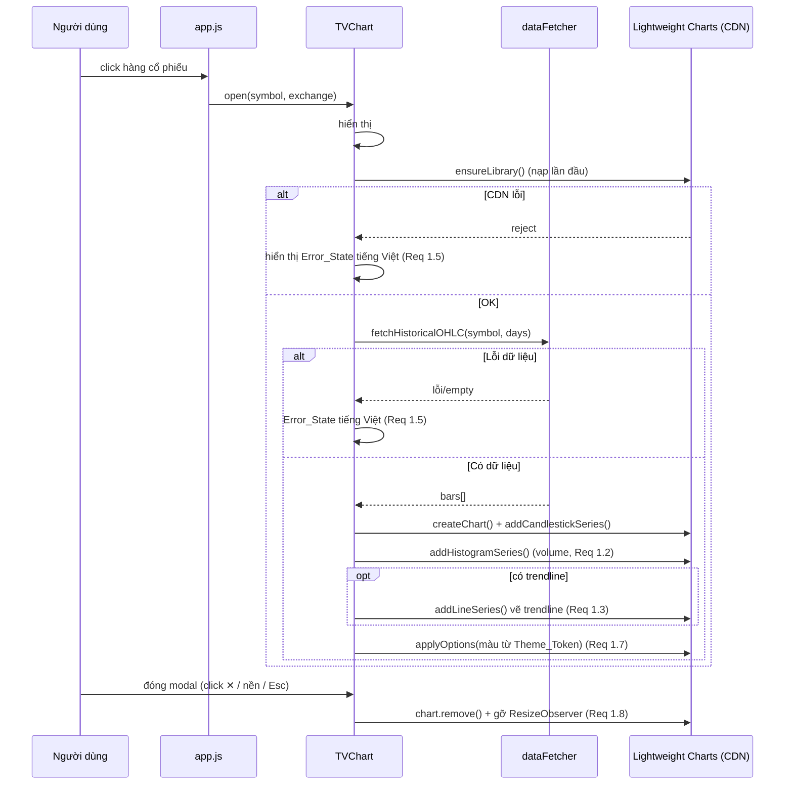

# Tài liệu Thiết kế (Design Document)

## Overview

_(Tổng quan)_

Tài liệu này mô tả thiết kế kỹ thuật cho dự án "Nâng cấp & Hoàn thiện Giao diện/Trải nghiệm người dùng" (UI/UX Overhaul) của ứng dụng VN Stock Market. Thiết kế tuân theo một nguyên tắc xuyên suốt: **nâng cấp tăng tiến, không phá vỡ (non-breaking, incremental enhancement)** trên nền kiến trúc HTML/CSS/JS thuần hiện có. Tài liệu này **không** đề xuất viết lại bằng React hay bất kỳ framework nào.

Năm nhóm thay đổi và cách chúng bám vào mã nguồn hiện tại:

1. **TradingView Lightweight Charts** — Thêm một module mới (`js/tv-chart.js`) tải thư viện Lightweight Charts qua CDN và vẽ biểu đồ nến/khối lượng/đường xu hướng từ dữ liệu `/api/historical` sẵn có, hiển thị trong `#tv-modal` đã tồn tại. Thay thế hành vi nhúng iframe `tv.js` hiện tại của hàm `openTradingViewModal()` mà không đụng đến các biểu đồ Chart.js khác. (Req 1)
2. **Design System** — Bổ sung và chuẩn hóa các Theme_Token trong khối `:root` của `css/style.css` (vốn đã có sẵn nhiều biến), thêm thang typography còn thiếu, và đồng bộ bảng màu cứng trong `js/charts.js` với token CSS. (Req 2)
3. **Skeleton Loading** — Mở rộng class `.skeleton` đã có thành một bộ component khung xương + một module tiện ích nhỏ (`js/ui-state.js`) quản lý 3 trạng thái Loading/Error/Empty cho mỗi Data_Panel. (Req 3)
4. **Dark theme & micro-interaction** — Tinh chỉnh thang đổ bóng/phân lớp nền và transition bằng CSS thuần, thêm khối `@media (prefers-reduced-motion: reduce)`. (Req 4)
5. **Responsive** — Viết lại phần media query để khớp với 3 mốc Breakpoint chuẩn (≤480px, 481–1024px, >1024px) và xử lý thanh nav 7 tab trên màn nhỏ. (Req 5)

Toàn bộ thay đổi giữ nguyên `app.js`, `api.js`, `grid-manager.js` về mặt hợp đồng dữ liệu và hành vi nghiệp vụ (Req 6).

### Hiện trạng quan trọng đã khảo sát trong mã nguồn

- `#tv-modal` đã tồn tại trong `index.html` với cấu trúc `.modal > .modal-content > .close-modal + #tv-modal-container`.
- `openTradingViewModal(symbol)` trong `app.js` đang dùng `new TradingView.widget({...})` (nhúng iframe từ `https://s3.tradingview.com/tv.js`) — **đây là TradingView Widget, không phải Lightweight Charts**. Thiết kế sẽ thay phần dựng biểu đồ bên trong hàm này.
- `api.js` đã có `dataFetcher.fetchHistoricalData(symbol, days)` nhưng chỉ map `Close` + `Volume`. Endpoint server `/api/historical` trả nguyên dữ liệu FireAnt `HistoricalQuotes` (có Open/High/Low/Close/Volume) → đủ dữ liệu cho biểu đồ nến.
- `css/style.css` đã có `:root` với token màu/spacing/radius/shadow/transition/z-index và một class `.skeleton` kèm `@keyframes shimmer`.
- `js/charts.js` dùng `CHART_COLORS` cứng (vd `green: '#00ff88'`) **lệch** với token `:root` (`--accent-green: #2ee68a`) → cần đồng bộ.
- Hàm `openTradingViewModal` đang gán `window.onclick` toàn cục để đóng modal → rủi ro ghi đè handler; thiết kế sẽ chuyển sang listener gắn theo modal.

## Architecture

_(Kiến trúc)_

Kiến trúc tổng thể giữ nguyên mô hình hiện tại: trình duyệt tải `index.html`, các module JS thuần gắn vào `window`, gọi server Node/Express proxy tới FireAnt. Phần nâng cấp thêm 2 module JS mới và một lớp token CSS, không thay đổi luồng dữ liệu nghiệp vụ.



### Nguyên tắc kiến trúc

- **Tách lớp rõ ràng**: module mới chỉ phụ thuộc vào `dataFetcher` (đọc dữ liệu) và token CSS (đọc màu). Không module hiện có nào phải sửa hợp đồng public.
- **Tải thư viện theo nhu cầu (lazy)**: Lightweight Charts được nạp lần đầu khi người dùng mở Chart_Modal, tránh tăng thời gian tải trang ban đầu.
- **Một nguồn sự thật cho thiết kế**: mọi giá trị màu/khoảng cách/chữ đến từ `:root`. JS đọc màu qua `getComputedStyle` thay vì hằng số cứng.
- **Suy giảm duyên dáng (graceful degradation)**: nếu CDN Lightweight Charts lỗi, Chart_Modal hiển thị Error_State tiếng Việt thay vì vỡ giao diện.

## Components and Interfaces

_(Thành phần và Giao diện)_

### 1. Lớp Design System Token (Req 2)

Mở rộng khối `:root` trong `css/style.css`. Giữ toàn bộ token hiện có, **bổ sung thang typography** (đang thiếu dưới dạng biến) và token semantic cho trạng thái tăng/giảm.

Bổ sung (minh hoạ):

```css
:root {
    /* Typography scale (BỔ SUNG) */
    --font-size-display: 2.1rem;   /* index-value, số liệu lớn */
    --font-size-h1: 1.6rem;
    --font-size-h2: 1.25rem;       /* section-title */
    --font-size-h3: 1rem;          /* card-header h3 */
    --font-size-body: 0.9rem;
    --font-size-label: 0.75rem;    /* nhãn phụ, stat-label */
    --font-size-micro: 0.65rem;

    --font-weight-regular: 400;
    --font-weight-medium: 500;
    --font-weight-semibold: 600;
    --font-weight-bold: 700;
    --line-height-tight: 1.2;
    --line-height-body: 1.6;

    /* Semantic state tokens (ánh xạ lên token màu sẵn có) */
    --color-up: var(--accent-green);
    --color-up-bg: var(--accent-green-bg);
    --color-down: var(--accent-red);
    --color-down-bg: var(--accent-red-bg);

    /* Token màu cho TradingView (đọc bởi JS) */
    --tv-bg: var(--bg-card);
    --tv-grid: var(--border-color);
    --tv-text: var(--text-secondary);
    --tv-up: var(--accent-green);
    --tv-down: var(--accent-red);
    --tv-volume-up: rgba(46, 230, 138, 0.5);
    --tv-volume-down: rgba(255, 92, 120, 0.5);
}
```

Chiến lược chuẩn hóa:
- **Quét và thay hard-code**: các giá trị màu/khoảng cách cố định nội tuyến trong CSS (vd `#333`, `20px`) được thay bằng `var(--token)` tương ứng (Req 2.2). Việc thay làm theo từng nhóm thành phần để dễ kiểm thử hồi quy hình ảnh.
- **Typography**: áp `--font-display` (Space Grotesk) cho heading, `--font-body` (Inter) cho nội dung; số liệu dùng `font-variant-numeric: tabular-nums` (class đã có) (Req 2.3, 2.4, 2.5).
- **Tăng/giảm**: thay class `.positive`/`.negative` để trỏ về `--color-up`/`--color-down` (Req 2.6).
- **Đồng nhất card**: định nghĩa lớp tiện ích chung (padding `--spacing-lg`, radius `--radius-lg`) dùng lại trên cả 7 tab (Req 2.7).

### 2. TVChartManager — Tích hợp TradingView Lightweight Charts (Req 1)

Module mới `js/tv-chart.js`, expose `window.TVChart`. Thay thế phần dựng biểu đồ trong `openTradingViewModal()`.

**Tải thư viện qua CDN** (thêm vào `index.html`, defer; hoặc nạp động lần đầu):

```html
<!-- Thêm cạnh các script hiện có -->
<script src="https://unpkg.com/lightweight-charts@4.2.0/dist/lightweight-charts.standalone.production.js"></script>
```

Phương án ưu tiên: **nạp động (lazy)** trong `TVChart.ensureLibrary()` để không ảnh hưởng tải trang đầu — tạo thẻ `<script>` khi mở modal lần đầu, cache promise.

Giao diện công khai:

```javascript
window.TVChart = {
    // Mở modal và vẽ biểu đồ nến + volume cho 1 mã
    open(symbol, exchange),
    // Dọn tài nguyên: chart.remove(), gỡ listener resize, xoá container
    destroy(),
    // (nội bộ) đảm bảo thư viện đã nạp, trả Promise
    ensureLibrary(),
    // (nội bộ) chuyển dữ liệu lịch sử -> định dạng Lightweight Charts
    toCandles(rawHistorical),
    toVolume(rawHistorical)
};
```

**Vòng đời (lifecycle)**:



Điểm thiết kế chính:
- **Volume cùng trục thời gian**: dùng `HistogramSeries` với `priceScaleId: ''` đặt ở khung dưới (scaleMargins), chia sẻ trục thời gian với nến (Req 1.2).
- **Trendline**: nếu `dataFetcher` cung cấp dữ liệu trendline cho mã (từ module TA/breakout), vẽ bằng `LineSeries` chồng lên; nếu không có thì bỏ qua (mệnh đề WHERE — Req 1.3).
- **Không thay thế Chart.js**: TVChart chỉ thao tác trong `#tv-modal-container`; các canvas Chart.js ở dashboard giữ nguyên (Req 1.4).
- **Resize**: dùng `ResizeObserver` trên container + lắng nghe `resize` cửa sổ, gọi `chart.applyOptions({ width, height })` (Req 1.6, 5.7).
- **Màu theo token**: đọc `getComputedStyle(document.documentElement).getPropertyValue('--tv-...')` để cấu hình `layout.background`, `grid`, `upColor`, `downColor` (Req 1.7).
- **Dọn tài nguyên**: `destroy()` gọi `chart.remove()`, `resizeObserver.disconnect()`, gỡ event listener và xoá `innerHTML` của container (Req 1.8). Thay `window.onclick` toàn cục bằng listener cục bộ + phím `Esc`.

### 3. UIState — Skeleton / Error / Empty (Req 3)

Module mới `js/ui-state.js`, expose `window.UIState`. Cung cấp API khai báo để mỗi nơi gọi `loadAllData()` / `loadMarketDashboard()`… chuyển một Data_Panel qua 4 trạng thái.

```javascript
window.UIState = {
    // Hiện khung xương đúng hình dạng nội dung
    showSkeleton(panelEl, variant /* 'table'|'list'|'card'|'chart' */, count),
    // Xoá skeleton, cho nội dung thật hiển thị
    showContent(panelEl),
    // Trạng thái lỗi + nút "Thử lại" (gọi onRetry)
    showError(panelEl, message, onRetry),
    // Trạng thái rỗng + thông báo tiếng Việt
    showEmpty(panelEl, message)
};
```

Skeleton dựng từ các khối dùng class `.skeleton` đã có (đã có shimmer). Các biến thể (variant) tạo cấu trúc khớp nội dung thật (Req 3.1):
- `table`: N hàng × M ô, mỗi ô là `.skeleton.skeleton-cell`.
- `list`: N dòng `.skeleton.skeleton-line` xen kẽ độ rộng.
- `card`: khối tiêu đề + vài dòng.
- `chart`: một khối chữ nhật cao bằng vùng biểu đồ.

CSS bổ sung:

```css
.skeleton-line { height: 14px; margin: 8px 0; }
.skeleton-cell { height: 18px; }
.skeleton-chart { width: 100%; height: 100%; min-height: 160px; }

.ui-error, .ui-empty {
    padding: var(--spacing-xl);
    text-align: center;
    color: var(--text-secondary);
}
.ui-error .retry-btn {
    margin-top: var(--spacing-md);
    min-height: 44px;   /* vùng chạm Req 5.5 */
    padding: var(--spacing-sm) var(--spacing-lg);
}

/* Reduced motion: tắt shimmer, để khối tĩnh (Req 3.7, 4.5) */
@media (prefers-reduced-motion: reduce) {
    .skeleton { animation: none; background: var(--bg-card-hover); }
}
```

Tích hợp: thay các chuỗi "Đang tải..."/"Đang tải dữ liệu..." trong `index.html` và `app.js` bằng lời gọi `UIState.showSkeleton(...)` tại điểm bắt đầu fetch, `showContent/showEmpty/showError` tại điểm kết thúc (Req 3.2, 3.4, 3.5, 3.6). Vì `app.js` đã có khối `try/catch/finally` ở `loadAllData()` và các hàm `load*`, các điểm chèn đã rõ ràng.

### 4. Dark theme & Micro-interaction (Req 4)

Thực hiện bằng CSS thuần, không thêm JS (trừ chỉ báo tiến trình đã có hook trong app):
- **Hover**: chuẩn hóa mọi phần tử tương tác dùng `transition: var(--transition-fast)` (0.15s) đến `--transition-normal` (0.3s), nằm trong dải yêu cầu 0.15–0.3s (Req 4.1).
- **Chuyển tab**: tận dụng `@keyframes fadeIn` đã áp cho `.tab-content.active` (Req 4.2).
- **Focus**: thêm quy tắc `:focus-visible` dùng `outline`/`box-shadow` màu `--accent-blue` cho input/select/nút (Req 4.3).
- **Chiều sâu**: áp thang `--shadow-sm/md/lg` và phân lớp nền `--bg-primary < --bg-secondary < --bg-card` nhất quán (Req 4.4).
- **Reduced motion**: khối `@media (prefers-reduced-motion: reduce)` đặt `animation: none` và `transition: none` cho hiệu ứng không thiết yếu (Req 4.5).
- **Tương phản**: chọn cặp `--text-primary` (#ffffff) trên `--bg-card` đạt ≥ 4.5:1; rà soát `--text-muted` ở những chỗ là nội dung (không chỉ trang trí) để đạt ngưỡng (Req 4.6).
- **Chỉ báo tiến trình ngầm**: nút refresh đã có animation spin; chuẩn hóa thêm chỉ báo cho thao tác quét tín hiệu (Req 4.7).

### 5. Responsive (Req 5)

Viết lại phần `@media` cuối `css/style.css` theo 3 Breakpoint chuẩn. Lưu ý: layout dashboard hiện dùng **flexbox** (`.market-overview`, `.dashboard-grid`) và **Gridstack** (đã có `breakpoints: [{ w: 768, c: 1 }]`), nên một số quy tắc `grid-template-columns` cũ là thừa và sẽ được dọn.

| Breakpoint | Phạm vi | Bố cục |
|---|---|---|
| Mobile_Layout | ≤ 480px | 1 cột; nav cuộn ngang/wrap; bảng cuộn ngang; vùng chạm ≥ 44px |
| Tablet_Layout | 481–1024px | tối đa 2 cột |
| Desktop_Layout | > 1024px | nhiều cột như hiện tại |

- **Một cột / hai cột**: dùng `flex-basis: 100%` (mobile) và `calc(50% - gap)` (tablet) cho card overview và dashboard-grid (Req 5.1, 5.2).
- **Nav 7 tab**: trên mobile cho `.nav { overflow-x: auto; flex-wrap: nowrap; }` với cuộn ngang mượt (`-webkit-overflow-scrolling: touch`), đảm bảo truy cập mọi tab không tràn (Req 5.3).
- **Bảng rộng**: các wrapper `.price-table-wrapper`, `.breakout-table-wrapper`… giữ `overflow-x: auto` để cuộn ngang trong khung, không tràn trang (Req 5.4).
- **Vùng chạm**: nút/tab/mục nhấp đặt `min-height: 44px; min-width: 44px` trên mobile (Req 5.5).
- **Không chồng lấp khi đổi breakpoint**: dùng đơn vị linh hoạt + `min-width: 0` cho flex item để tránh tràn nội dung (Req 5.6).
- **Biểu đồ co giãn**: Chart.js đã `responsive: true; maintainAspectRatio: false`; TVChart dùng ResizeObserver → cả hai vừa khít chiều rộng vùng chứa (Req 5.7).

### 6. Bảo toàn chức năng (Req 6)

- Không xoá/đổi tên 7 tab và các `data-tab`; chỉ thêm CSS/skeleton (Req 6.1).
- `grid-manager.js` giữ nguyên — skeleton chèn vào nội dung panel, không đụng cấu trúc `.grid-stack-item` (Req 6.2).
- Lọc/sắp xếp/tìm kiếm trong `app.js` giữ nguyên handler (Req 6.3).
- Auto-refresh 60s giữ nguyên; chỉ thêm chuyển trạng thái UIState quanh fetch (Req 6.4).
- Các khóa localStorage (`vnstock_gridstack_layout_v1`, `vnstock_gridstack_state_v1`, `vnstock_priceboard_settings`) không bị động tới (Req 6.5).

## Data Models

_(Mô hình dữ liệu)_

### Theme_Token (CSS custom properties)

Token là cặp `--ten: giá-trị` trong `:root`, phân nhóm: màu nền, màu chữ, màu nhấn, gradient, shadow, spacing, radius, transition, font, typography scale, z-index, semantic state. JS đọc qua `getComputedStyle`.

### OHLCV Bar (đầu vào Lightweight Charts)

Lightweight Charts yêu cầu dữ liệu **sắp xếp tăng dần theo thời gian** và **không trùng timestamp**.

```typescript
// Candlestick
interface Candle {
    time: number;   // UNIX seconds (UTC), hoặc 'yyyy-mm-dd'
    open: number;
    high: number;
    low: number;
    close: number;
}
// Volume histogram (cùng trục thời gian)
interface VolumeBar {
    time: number;   // khớp 1-1 với Candle.time
    value: number;
    color: string;  // xanh nếu close>=open, đỏ nếu ngược lại
}
```

Hàm adapter `toCandles(raw)` / `toVolume(raw)` chuyển dữ liệu thô FireAnt (`{ Date, Open|PriceOpen, High, Low, Close, Volume }`) sang định dạng trên: parse thời gian, loại bản ghi thiếu OHLC, **sắp xếp tăng dần theo time**, **khử trùng timestamp** (giữ bản ghi cuối).

### Panel UI State

```typescript
type PanelState = 'loading' | 'content' | 'error' | 'empty';
```

Trạng thái là thuộc tính trực quan của một Data_Panel; mỗi panel độc lập.

## Correctness Properties

_(Thuộc tính đúng đắn)_

*Thuộc tính (property) là một đặc tính/hành vi phải luôn đúng trên mọi lần thực thi hợp lệ của hệ thống — một phát biểu hình thức về việc hệ thống phải làm gì. Thuộc tính là cầu nối giữa đặc tả cho người đọc và các bảo đảm đúng đắn kiểm chứng được bằng máy.*

Phần lớn tính năng này là UI/CSS/tích hợp thư viện bên thứ ba (không hợp với property-based testing). Tuy nhiên có **một lõi logic thuần** đáng kiểm thử theo thuộc tính: **adapter chuyển dữ liệu lịch sử thô sang định dạng Lightweight Charts** (`toCandles`/`toVolume`). Lightweight Charts đặt ràng buộc cứng (tăng dần theo thời gian, không trùng timestamp); nếu adapter sai, biểu đồ sẽ ném lỗi hoặc vẽ sai. Đây là hàm thuần, biến thiên theo đầu vào, đáng chạy 100+ vòng. Các tiêu chí còn lại được kiểm bằng unit/snapshot/integration test (xem Testing Strategy).

### Property 1: Adapter sinh dữ liệu hợp lệ và canh trục thời gian cho Lightweight Charts

*For any* mảng bản ghi lịch sử thô (gồm cả bản ghi hợp lệ, thiếu trường, và trùng/đảo thứ tự ngày), kết quả của `toCandles(raw)` và `toVolume(raw)` phải: (a) có time **sắp xếp tăng dần nghiêm ngặt**, (b) **không có timestamp trùng**, (c) mọi nến có `low <= open,close,high` và `high >= open,close`, và (d) mảng volume **khớp 1-1 về timestamp** với mảng nến (cùng độ dài, cùng tập time theo thứ tự).

**Validates: Requirements 1.1, 1.2**

### Property 2: Màu volume nhất quán với chiều nến

*For any* tập bản ghi lịch sử hợp lệ, với mỗi chỉ số i, `toVolume(raw)[i].color` là token màu tăng khi `close[i] >= open[i]` và là token màu giảm khi `close[i] < open[i]`.

**Validates: Requirements 1.2, 1.7**

## Error Handling

_(Xử lý lỗi)_

- **CDN Lightweight Charts lỗi**: `ensureLibrary()` reject → Chart_Modal hiển thị Error_State tiếng Việt ("Không tải được thư viện biểu đồ. Vui lòng thử lại.") kèm nút thử lại (Req 1.5).
- **Lỗi/empty dữ liệu lịch sử**: nếu `fetchHistoricalOHLC` ném lỗi hoặc trả mảng rỗng → Error_State/Empty_State tiếng Việt trong modal (Req 1.5, 3.6).
- **Lỗi tải Data_Panel**: `UIState.showError(panel, msg, onRetry)` hiển thị thông báo tiếng Việt + nút "Thử lại" gọi lại hàm fetch tương ứng (Req 3.5). Giữ logic hiện có "không ghi đè dữ liệu cũ còn tốt" (vd `_marketDashboardLoaded`).
- **Adapter gặp bản ghi xấu**: bỏ qua bản ghi thiếu OHLC thay vì ném lỗi; nếu sau khi lọc còn rỗng → Empty_State.
- **Dọn tài nguyên kể cả khi lỗi**: `destroy()` an toàn gọi nhiều lần (idempotent), bọc `try/catch` quanh `chart.remove()`.

## Testing Strategy

_(Chiến lược kiểm thử)_

Áp dụng cách tiếp cận kép: property test cho lõi logic thuần, còn lại dùng unit/snapshot/integration test phù hợp bản chất UI.

### Property-based tests (lõi adapter)

- Dùng thư viện **fast-check** (hệ sinh thái JS, không tự viết engine).
- Mỗi property chạy **tối thiểu 100 vòng**.
- Mỗi test gắn nhãn tham chiếu property thiết kế.
  - Định dạng nhãn: **Feature: ui-ux-overhaul, Property {số}: {nội dung}**
- Phạm vi: `toCandles`/`toVolume` (Property 1, 2). Generator sinh mảng bản ghi gồm ngày trùng, ngày đảo thứ tự, trường OHLC thiếu/`null`, giá trị âm để ép edge case.

### Unit tests (ví dụ cụ thể & edge case)

- `ensureLibrary()` cache promise (chỉ chèn 1 thẻ script dù gọi nhiều lần).
- `destroy()` gọi 2 lần không ném lỗi (idempotent) và thực sự gọi `chart.remove()`/`resizeObserver.disconnect()` (mock).
- `UIState.showError` render nút "Thử lại" và gọi `onRetry` khi click.
- Adapter với mảng rỗng → trả mảng rỗng (để caller chuyển Empty_State).

### Snapshot / Visual regression (UI & Design System)

- Snapshot DOM của skeleton từng variant (table/list/card/chart) để chống hồi quy cấu trúc.
- Kiểm thử trực quan dark theme + responsive ở 3 breakpoint (≤480 / 768 / >1024) — kiểm bằng mắt + ảnh chụp; không phù hợp PBT.
- Kiểm tra token: không còn màu/khoảng cách hard-code ở các thành phần đã chuẩn hóa (lint CSS hoặc rà soát thủ công).

### Integration / Smoke tests

- Mở Chart_Modal cho 1–2 mã thật → xác nhận nến + volume hiển thị, đóng modal giải phóng tài nguyên (Req 1.8).
- Kiểm thủ công `prefers-reduced-motion` bật/tắt: skeleton tĩnh, transition tắt (Req 3.7, 4.5).
- Hồi quy chức năng: 7 tab, kéo-thả/resize Gridstack, lọc/sắp xếp/tìm kiếm, auto-refresh, khôi phục localStorage vẫn hoạt động (Req 6).

### Kiểm thử khả năng tiếp cận (Accessibility)

- Đo tương phản văn bản/nền đạt ≥ 4.5:1 (Req 4.6) bằng công cụ kiểm tra tương phản. Lưu ý: xác nhận đầy đủ WCAG cần kiểm thử thủ công với công nghệ hỗ trợ và rà soát bởi chuyên gia.
- Kiểm tra vùng chạm ≥ 44×44px trên mobile (Req 5.5).

## Mapping Thiết kế → Yêu cầu (tóm tắt)

| Thành phần thiết kế | Yêu cầu |
|---|---|
| TVChartManager (`js/tv-chart.js`) | Req 1.1–1.8, 5.7 |
| Lớp Design System Token (`:root`) | Req 2.1–2.7, 4.3, 4.4 |
| UIState skeleton/error/empty (`js/ui-state.js`) | Req 3.1–3.7 |
| CSS micro-interaction & reduced-motion | Req 4.1–4.7, 3.7 |
| Lớp responsive (media query) | Req 5.1–5.7 |
| Giữ nguyên app/api/grid/charts | Req 6.1–6.5 |
| Adapter `toCandles`/`toVolume` (Correctness Properties) | Req 1.1, 1.2, 1.7 |
